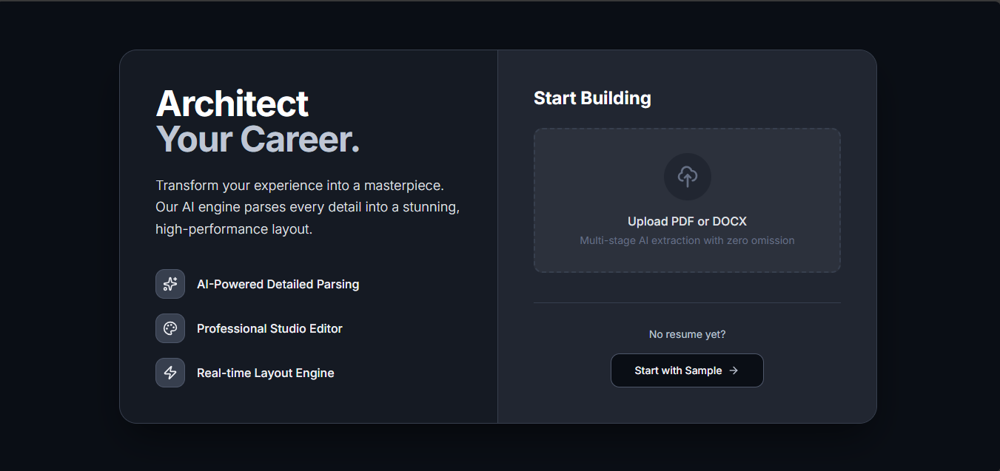
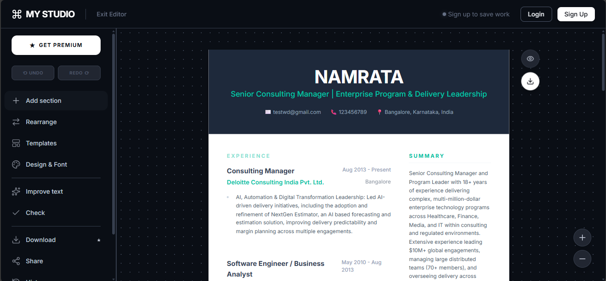

# My Studio - Professional Resume Builder

**Architect Your Career.** Transform your experience into a masterpiece with our high-performance resume builder.

## Features

### 🎨 Stunning Templates
Choose from a diverse collection of professionally designed templates, now including **Profile Picture** support:
- **Creative w/ Photo**: Artistic design with abstract headers.
- **Modern Side**: Sleek dark sidebar with profile photo.
- **Minimalist Circle**: Clean, centered layout.
- **Pro Header**: Executive full-width header.
- *Classic options*: Ivy League, Double Column, Executive, and more.

### 🖼️ Profile Picture Support
Upload, preview, and integrate your professional headshot directly into supported templates.

### 🤖 AI-Powered Writing Assistant
- **Improve Writing**: Polish your bullet points with a single click.
- **Recruiter Review**: Get AI feedback on your resume content.
- **Tailored Summary**: Generate professional summaries based on your profile.

### 🛠️ Advanced Editor
- **Real-time Preview**: See changes instantly as you type.
- **Customizable Design**: Adjust margins, fonts, colors, and line heights.
- **Drag-and-Drop**: Easily rearrange sections and items.
- **Rich Text Formatting**: Bold, italic, underline, and link support.

### 📄 Export & Sharing
- **Pixel-Perfect PDF**: Download high-quality PDFs ready for applications.
- **Privacy Focused**: Your data stays local until you choose to sign up.

## getting Started

1. **Clone the repository**
2. **Install dependencies**: `npm install`
3. **Run development server**: `npm run dev`
4. **Build for production**: `npm run build`

---

Built with React, TypeScript, and Tailwind CSS.
